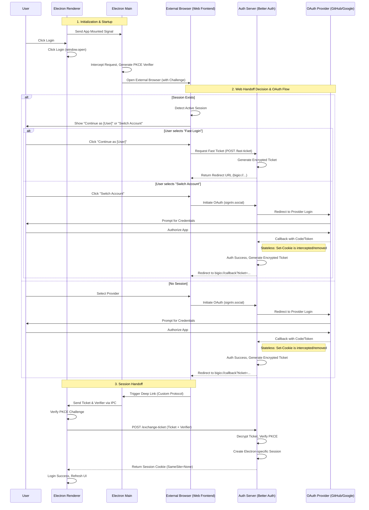

# @bigio/better-auth-electron

This plugin establishes a secure, **event-driven** authentication bridge between Electron and Better Auth. It treats the system browser strictly as a **stateless transport layer**, utilizing **AES-encrypted tickets** and **PKCE verification** to perform session handoff without persisting web cookies in the desktop environment.

The renderer implementation abandons traditional redirect handling in favor of an IPC-based subscription model (`onDeepLink*`). It features a built-in **cold-start buffer** to guarantee token capture even if the deep link triggers the application before the UI is fully mounted. The API surface is designed to mirror the official Better Auth client patterns, ensuring strict typing and zero-friction integration.

### Key Architecture

- **Stateless Web Handoff**: The browser authenticates via OAuth but does not share the session with Electron. It passes an encrypted, time-limited ticket back to the desktop app.
- **Security**: Full PKCE flow (Proof Key for Code Exchange) with verified challenges and AES-encrypted exchange tickets.
- **Event-Driven Renderer**: No page reloads or router redirects. Listen for `onDeepLinkSuccess`, `onDeepLinkNewUser`, or `onDeepLinkFailed` directly within your React/Vue components.
- **Cold Start Support**: Includes an internal IPC buffer to cache deep link events that occur during the application boot phase, ensuring no authentication intent is lost while the renderer initializes.
- **API Parity**: Extends the `authClient` with a `bigio` namespace that mimics standard Better Auth methods (e.g., `signInSocial`).
- **Native Secure Context & Origin Fix:** Leverages `protocol.registerSchemesAsPrivileged` to treat your custom scheme as a secure context. This solves the infamous `Origin` header mismatch.

#### _I'm currently studying the official implementation; the documentation is still rough but will be improved soon. I'm eager and looking forward to exchanging ideas with everyone._

# Authentication Flow

The following diagram illustrates the complete OAuth authorization and session handoff process, including the interaction with external **OAuth Providers** (e.g., GitHub, Google):



Based on my study of the official implementation code, I have decided on the following to-do list:

**~~1. Architecture: The "Silent Handoff" (Stateless & Secure)~~**

- [done] ~~**Server-Side Cookie Interception**: Modify `electron-server-plugin` to intercept the OAuth callback response.~~
- ~~_Action_: Strip the `Set-Cookie` header (specifically the session token) from the response to prevent overwriting the user's browser session.~~
- ~~_Goal_: Achieve strict physical isolation between Web Session and Electron Session.~~

- ~~**Stateless OAuth Flow**: Ensure the OAuth flow relies solely on the encrypted `Ticket` mechanism, making the browser a purely stateless transport layer for Electron authentication.~~

**2. Security & Hardening**

- [ ] **Secure Persistence**: Implement `safeStorage` (DPAPI/Keychain) for encrypting the persisted PKCE Verifier on disk.
- _Reason_: Prevent plaintext credentials from resting on the file system.

- [ ] **User-Agent Scrubbing**: Global removal of "Electron" tokens from the `User-Agent` string at the `app.on('ready')` stage.
- _Reason_: Bypass WAF/Anti-Bot protections that block Electron-based requests during the ticket exchange phase.

- [done] ~~**Automated CSP Injection**: Implement `onHeadersReceived` interceptor in the Main Process.~~
  - ~~_Action_: Automatically append the backend API URL to the `connect-src` directive.~~
  - ~~_Goal_: Provide a "Zero-Config" experience by preventing CSP violations without requiring users to manually edit `index.html`.~~

**3. Developer Experience (DX) & API**

- [done] ~~**Enhanced Renderer API**: Refactor `getActions` to introduce a dedicated `authClient.bigio` namespace.~~
- ~~_Feature_: Implement `authClient.bigio.signIn({ provider: 'github' })` wrapper.~~
- ~~_Implementation_: Utilize `window.open` (intercepted by Main) or IPC to trigger the flow, keeping the API consistent with the official web client style.~~

- [done] ~~**Smart Web Handoff UI (Optional/Next)**: Update the web-side confirmation page to detect and display the currently logged-in web user, offering a "Continue as [User]" button for a seamless transition.~~

# Installation

```bash
pnpm add @bigio/better-auth-electron
```

Ensure peer dependencies are installed:(more framework support coming soon...)

```bash
pnpm add better-auth electron react react-dom
```

# Quick Start

### 1. Server Setup (`src/lib/auth.ts`)

Initialize Better Auth with the `electronServerPlugin`. This handles the ticket exchange and verification logic on your backend.

#### The "Silent Handoff" Mechanism (Stateless & Secure)

This plugin implements a **Server-Side Cookie Interception** strategy to ensure strict isolation between the Web Session and the Electron Session.

- It intercepts OAuth callback responses specifically for Electron. It actively **removes the `Set-Cookie` header** (which contains the session token) before the response reaches the browser.
- This guarantees that the Electron login flow **does not overwrite or interfere** with the user's existing browser session.
- Authentication relies solely on a one-time encrypted Ticket. The browser acts as a purely **`stateless`** transport layer for Electron.

```typescript
import { betterAuth } from 'better-auth'
import { electronServerPlugin } from '@bigio/better-auth-electron/server'

export const auth = betterAuth({
  baseURL: 'http://localhost:3002',
  // ... your database configuration
  plugins: [
    electronServerPlugin({
      // The custom scheme your Electron app uses (e.g. bigio://)
      ELECTRON_SCHEME: 'bigio',
      // Allowed providers for Electron OAuth flow
      PROVIDERS: ['github', 'google'],
    }),
  ],
  database: {
    //...
  },
})
```

### 2. Electron Main Process (`src/main/index.ts`)

Use `mainInjection` to setup IPC handlers and deep linking strategies. This automatically handles the "protocol" opening events.

### Security & CSP Configuration

** IMPORTANT: Clean up your `index.html`**

This plugin automatically injects a rigorous, production-ready **Content Security Policy (CSP)** via the Main Process.

**You CAN remove** any manual CSP `<meta>` tags from your `index.html` (renderer). Leaving them in will cause the browser to enforce the "intersection" of both policies, likely breaking your Auth flow (e.g., blocking the OAuth popup or API connection).

**DELETE this from your `index.html`:**

```html
<meta
  http-equiv="Content-Security-Policy"
  content="
  default-src 'self'; 
  script-src 'self'; 
  style-src 'self' 'unsafe-inline';
  img-src 'self' data:;
  connect-src 'self' http://localhost;
  " />
```

```typescript
import { app, BrowserWindow } from 'electron'
import { mainInjection } from '@bigio/better-auth-electron/main'

// Initialize the plugin logic
const { windowInjection, whenReadyInjection } = mainInjection({
  isOAuth: true,
  ELECTRON_APP_NAME: 'bigio-electron-demo',
  ELECTRON_SCHEME: 'bigio', // Must match the server config
  PROVIDERS: ['github', 'google'],
  BETTER_AUTH_BASEURL: 'http://localhost:3002',
  FRONTEND_URL: 'http://localhost:3001/oauth',
  /**
   * [Optional] Content Security Policy (CSP) Configuration
   * * Strategy: "All-or-Nothing"
   * - undefined (Default): The plugin automatically injects a secure, production-ready CSP (The "MVP" Fallback).
   * - string: The plugin uses YOUR string exactly. No merging, no magic. You take full control.
   */
  CONTENT_SECURITY_POLICY: "default-src 'self'; ...", // override completely
})

function createWindow(): void {
  const mainWindow = new BrowserWindow({
    /* config */
  })

  // Inject ipcRenderer event into the specific window instance
  windowInjection(mainWindow)
}

app.whenReady().then(() => {
  // Register custom protocol schemes
  whenReadyInjection()
  createWindow()
})
```

**If CONTENT_SECURITY_POLICY is not provided, the plugin applies the following strictly secure rules to the Main Frame (index.html) automatically. This ensures Auth works out-of-the-box while keeping your app secure.**

```http
default-src 'self';
script-src 'self';
style-src 'self' 'unsafe-inline';
# Allows loading images from 'self', OAuth providers (https:), and your Auth Server
img-src 'self' data: blob: https: ${BETTER_AUTH_BASEURL};
# Strictly restricts API connections to 'self' and your Auth Server
connect-src 'self' ${BETTER_AUTH_BASEURL};
font-src 'self' data:;
# Prevents clickjacking attacks
frame-ancestors 'none';
```

### 3. Web Client Initialization (`src/web/client.ts`)

Configure the client-side plugin. Note the usage of `setLazyClient` to handle circular dependencies or lazy initialization patterns effectively.

```typescript
import { createAuthClient } from 'better-auth/react'
import { electronWebHandoffPlugin, setLazyClient } from '@bigio/better-auth-electron/web'
import type { auth } from '@/lib/auth' // Import type from your server file

export const authClient = createAuthClient({
  baseURL: 'http://localhost:3002',
  fetchOptions: {
    credentials: 'include',
  },
  plugins: [
    // Type-safe plugin initialization
    electronWebHandoffPlugin<typeof auth>(),
  ],
})

// Important: Register the client instance for plugin lazy access, this for soical signin
setLazyClient(authClient)
```

### 4. Electron Renderer/Web Client (`src/renderer/lib/auth-client.ts`)

This is the auth client running **inside your Electron app**. It listens for the custom protocol deep link to hydrate the session.

> **Suggestion:** set `credentials: 'include'` to ensure the session cookie generated by the secure protocol is correctly persisted.

```typescript
import { createAuthClient } from 'better-auth/react'
import { electronRendererPlugin } from '@bigio/better-auth-electron/renderer'

export const authClient = createAuthClient({
  baseURL: 'http://localhost:3002',
  fetchOptions: {
    // It ensures cookies are sent/received correctly in the custom scheme.
    credentials: 'include',
  },
  plugins: [
    electronRendererPlugin({
      ELECTRON_SCHEME: 'bigio', // Must match Main process config
    }),
  ],
})
```

### 5. Electron Renderer Integration (New API)

I have refactored the client-side integration to closely mirror the official Better Auth API structure, while adapting it for the specific constraints of the Electron environment (IPC & Deep Linking).

### Key Features

- **Official API Parity:** Uses a syntax similar to `authClient.signIn.social`.
- **Callback Functions over URLs:** Instead of handling redirects, we use event subscriptions (`onDeepLinkSuccess`, `onDeepLinkNewUser`) to handle the authentication result.
- **Cold Start Support:** The plugin includes an internal buffer. If the application is opened via a Deep Link before the UI is fully mounted, the plugin caches the session data and triggers the callback immediately upon registration.

### Implementation

In your Electron renderer (e.g., `src/renderer/pages/login.tsx`), use the `bigio` namespace exposed by the client plugin.

#### 1. Triggering the Sign-In

Use `signInSocial` to initiate the flow. This handles the construction of the OAuth URL, serialization of scopes/parameters, and automatically opens the system default browser.

**Note on Constraints:**

1. **`disableRedirect`** is forced to `false`. The flow _must_ redirect to the deep link scheme to trigger the Electron app.
2. **`additionalData`** is **JSON serialized and encoded into the URL**. Do not pass sensitive data or large objects, as they may hit browser URL length limits.

```tsx
import { authClient } from '@/lib/auth-client' // Your initialized client

// ... inside your component
;<button
  onClick={async () => {
    await authClient.bigio.signInSocial({
      // [Required] The provider key (e.g., 'github', 'google')
      provider: 'github',

      // [Optional] Array of OAuth scopes
      scopes: ['repo', 'user'],

      // [Optional] Object passed to the backend (JSON serialized via URL)
      // Warning: Keep this payload small to avoid URL length issues.
      additionalData: {
        theme: 'dark',
        ref_source: 'desktop_app',
      },

      // [Optional] Hint for the provider (e.g., email address)
      loginHint: 'user@example.com',

      // [Optional] Force a sign-up screen instead of sign-in
      requestSignUp: false,
    })
  }}>
  Sign in with GitHub
</button>
```

#### 2. Handling the Callback (Deep Link)

Instead of a page redirect, we listen for IPC completion events. You **must** register listeners for success, failure, and (optionally) new user creation.

These functions return an **unsubscribe** handler. You are responsible for cleaning this up to prevent memory leaks or double-firing events.

```tsx
import { useEffect } from 'react'
import { useNavigate } from 'react-router-dom'
import { authClient } from '@/lib/auth-client'

export default function LoginPage() {
    const navigate = useNavigate()

    useEffect(() => {
        // 1. Handle Successful Login (Returning User)
        const unsubscribeSuccess = authClient.bigio.onDeepLinkSuccess(async (data) => {
            console.log('Login Successful:', data)
            // data contains { user, session }
            navigate('/dashboard')
            return true
        })

        // 2. Handle New User Registration (First Time Login)
        // If not provided, 'onDeepLinkSuccess' might be triggered depending on backend config,
        // but it is recommended to handle new users explicitly if you have an onboarding flow.
        const unsubscribeNewUser = authClient.bigio.onDeepLinkNewUser(async (data) => {
             console.log('New User Registered:', data)
             // data contains { user, session }
             navigate('/onboarding')
             return true
        })

        // 3. Handle Errors (Network issues, User denied access, Invalid State)
        const unsubscribeError = authClient.bigio.onDeepLinkFailed(async (error) => {
            console.error('Authentication Failed:', error)
            // Show toast or error message
        })

        // Cleanup: Essential for React's StrictMode and component unmounting
        return () => {
            unsubscribeSuccess()
            unsubscribeNewUser()
            unsubscribeError()
        }
    }, [])

    return (
        // ... your JSX
    )
}

```

### API Reference: `signInSocial`

| Parameter        | Type                      | Description                                                        |
| ---------------- | ------------------------- | ------------------------------------------------------------------ |
| `provider`       | `string`                  | **Required.** The key of the provider (e.g., `github`).            |
| `scopes`         | `string[]`                | **Optional.** Additional OAuth scopes to request.                  |
| `additionalData` | `Record<string, unknown>` | **Optional.** Metadata sent to the backend. **Serialized to URL.** |
| `loginHint`      | `string`                  | **Optional.** Passes a hint (usually email) to the provider.       |
| `requestSignUp`  | `boolean`                 | **Optional.** Hints the provider to show the registration page.    |

### 6. Web/App Component Usage (`src/web/components/user-session.tsx`)

The `useElectronOAuthSession` hook is the core of the "Handoff" experience. It manages the synchronization between the web authentication state and the Electron application.

#### Component Implementation

The hook provides reactive states to manage the UI. Most importantly, the 'pending' state serves as a "Session Detected" signal.

To resolve this state, you use the `setFastLogin` function. Calling this function immediately updates the oauthStatus and triggers the next step in the authentication flow.

```tsx
import { useEffect } from 'react'
import { authClient } from '@/web/client'

export function UserSessionStatus() {
  const {
    data: sessionData,
    error,
    isPending, // Initial loading state

    // Status enum: 'idle' | 'pending' | 'connecting' | 'succeed' | 'failed'
    // 'pending': CRITICAL state. It confirms a valid session ALREADY exists
    // and the system is pausing to wait for the user's decision.
    oauthStatus,
    oauthError,

    // Action to control the flow:
    // setFastLogin(true)  = Fast Login (Use current session)
    // setFastLogin(false) = Switch Account (Ignore current session)
    setFastLogin,
  } = authClient.bigio.useElectronOAuthSession()

  /**
   * Optional: Force Logic (Auto-decision)
   * If you want to skip the user choice UI:
   */
  useEffect(() => {
    setFastLogin(true) // Force Fast Login immediately
    // OR
    setFastLogin(false) // Force Switch Account immediately
  }, [])

  /**
   * Optional: User-decision
   * If you want to let the user choice:
   */
  return (
    <div>
      {/* The 'pending' status indicates a session collision/detection.
        We present the choice to the user here.
      */}
      {oauthStatus === 'pending' ? (
        <>
          {/* Option: Ignore current session and re-login */}
          <button onClick={() => setFastLogin(false)}>Switch Account</button>
          {/* Option: Use current session for Electron */}
          <button onClick={() => setFastLogin(true)}>Fast Login</button>
        </>
      ) : null}
    </div>
  )
}
```

## License

MIT © [bigmusic](https://github.com/bigmusic/better-auth-electron)
