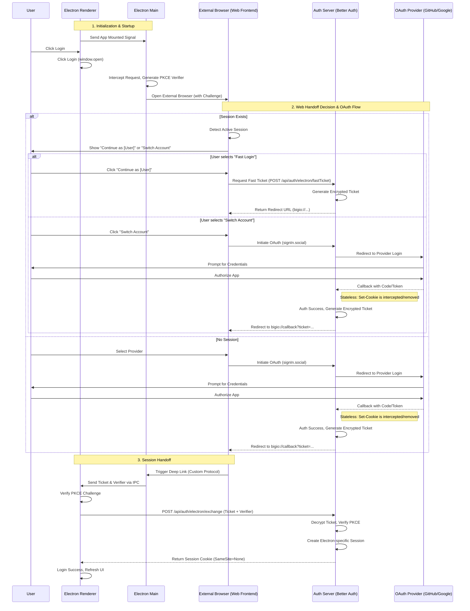

# @bigio/better-auth-electron

Refactor notice: this project is being updated to ensure compatibility with Better Auth `v1.5.x` (latest patch line).

This plugin implements an **event-driven** authentication bridge between Electron and Better Auth. It uses **AES-encrypted tickets** and **PKCE verification** for session handoff, and is designed so Electron authentication does not depend on sharing browser session cookies.

The renderer side uses an IPC subscription model (`onDeepLink*`) instead of redirect-driven UI handling. It includes a cold-start buffer for deep-link events that arrive before the renderer is mounted. The API shape follows common Better Auth client naming patterns while keeping Electron-specific behavior explicit.

### Key Architecture

- **Stateless Web Handoff**: OAuth runs in the browser, and Electron receives an encrypted, time-limited ticket for session handoff.
- **Security**: Full PKCE flow (Proof Key for Code Exchange) with verified challenges and AES-encrypted exchange tickets.
- **Event-Driven Renderer**: No page reloads or router redirects. Listen for `onDeepLinkSuccess`, `onDeepLinkNewUser`, or `onDeepLinkFailed` directly within your React/Vue components.
- **Cold Start Support**: Uses an internal IPC buffer to hold deep-link events during application startup until the renderer is ready.
- **API Alignment**: Extends `authClient` with a `bigio` namespace using familiar method naming (for example, `signInSocial`).
- **Secure Context and Origin Handling**: Uses `protocol.registerSchemesAsPrivileged` so the custom scheme is treated as a secure context and origin handling remains predictable.

#### _This is a personal plugin project. The docs are still evolving and will be refined continuously._

# Authentication Flow

The following diagram illustrates the complete OAuth authorization and session handoff process, including the interaction with external **OAuth Providers** (e.g., GitHub, Google):


```mermaid
sequenceDiagram
    participant User as User
    participant E_R as Electron Renderer
    participant E_M as Electron Main
    participant Browser as External Browser (Web Frontend)
    participant Server as Auth Server (Better Auth)
    participant Provider as OAuth Provider (GitHub/Google)

    Note over E_R, E_M: 1. Initialization & Startup
    E_R->>E_M: Send App Mounted Signal
    User->>E_R: Click Login
    E_R->>E_R: Click Login (window.open)
    E_M->>E_M: Intercept Request, Generate PKCE Verifier
    E_M->>Browser: Open External Browser (with Challenge)

    Note over Browser, Provider: 2. Web Handoff Decision & OAuth Flow
    alt Session Exists
        Browser->>Browser: Detect Active Session
        Browser->>User: Show "Continue as [User]" or "Switch Account"
        alt User selects "Fast Login"
            User->>Browser: Click "Continue as [User]"
            Browser->>Server: Request Fast Ticket (POST /api/auth/electron/fastTicket)
            Server->>Server: Generate Encrypted Ticket
            Server-->>Browser: Return Redirect URL (bigio://...)
        else User selects "Switch Account"
            User->>Browser: Click "Switch Account"
            Browser->>Server: Initiate OAuth (signIn.social)
            Server->>Provider: Redirect to Provider Login
            Provider->>User: Prompt for Credentials
            User->>Provider: Authorize App
            Provider-->>Server: Callback with Code/Token
            Note right of Server: Stateless: Set-Cookie is intercepted/removed
            Server->>Server: Auth Success, Generate Encrypted Ticket
            Server-->>Browser: Redirect to bigio://callback?ticket=...
        end
    else No Session
        User->>Browser: Select Provider
        Browser->>Server: Initiate OAuth (signIn.social)
        Server->>Provider: Redirect to Provider Login
        Provider->>User: Prompt for Credentials
        User->>Provider: Authorize App
        Provider-->>Server: Callback with Code/Token
        Note right of Server: Stateless: Set-Cookie is intercepted/removed
        Server->>Server: Auth Success, Generate Encrypted Ticket
        Server-->>Browser: Redirect to bigio://callback?ticket=...
    end

    Note over Browser, E_R: 3. Session Handoff
    Browser->>E_M: Trigger Deep Link (Custom Protocol)
    E_M->>E_R: Send Ticket & Verifier via IPC
    E_R->>E_R: Verify PKCE Challenge
    E_R->>Server: POST /api/auth/electron/exchange (Ticket + Verifier)
    Server->>Server: Decrypt Ticket, Verify PKCE
    Server->>Server: Create Electron-specific Session
    Server-->>E_R: Return Session Cookie (SameSite=None)
    E_R->>E_R: Login Success, Refresh UI
```

Current roadmap:

**~~1. Architecture: The "Silent Handoff" (Stateless & Secure)~~**

- [done] ~~**Server-Side Cookie Interception**: Modify `electron-server-plugin` to intercept the OAuth callback response.~~
- ~~_Action_: Strip the `Set-Cookie` header (specifically the session token) from the response to prevent overwriting the user's browser session.~~
- ~~_Goal_: Achieve strict physical isolation between Web Session and Electron Session.~~

- ~~**Stateless OAuth Flow**: Ensure the OAuth flow relies solely on the encrypted `Ticket` mechanism, making the browser a purely stateless transport layer for Electron authentication.~~

**2. Security & Hardening**

- [ ] **Secure Persistence**: Implement `safeStorage` (DPAPI/Keychain) for encrypting the persisted PKCE Verifier on disk.
- _Reason_: Prevent plaintext credentials from resting on the file system.

- [ ] **User-Agent Scrubbing**: Global removal of "Electron" tokens from the `User-Agent` string at the `app.on('ready')` stage.
- _Reason_: Bypass WAF/Anti-Bot protections that block Electron-based requests during the ticket exchange phase.

- [done] ~~**Automated CSP Injection**: Implement `onHeadersReceived` interceptor in the Main Process.~~
  - ~~_Action_: Automatically append the backend API URL to the `connect-src` directive.~~
  - ~~_Goal_: Provide a "Zero-Config" experience by preventing CSP violations without requiring users to manually edit `index.html`.~~

**3. Developer Experience (DX) & API**

- [done] ~~**Enhanced Renderer API**: Refactor `getActions` to introduce a dedicated `authClient.bigio` namespace.~~
- ~~_Feature_: Implement `authClient.bigio.signIn({ provider: 'github' })` wrapper.~~
- ~~_Implementation_: Utilize `window.open` (intercepted by Main) or IPC to trigger the flow, keeping the API consistent with the official web client style.~~

- [done] ~~**Smart Web Handoff UI (Optional/Next)**: Update the web-side confirmation page to detect and display the currently logged-in web user, offering a "Continue as [User]" button for a seamless transition.~~

**4. Runtime Robustness & Architecture**

- [ ] **Multi-Window Instance Support**: Support concurrent authentication flows across multiple Electron windows without shared-state collisions.
- _Reason_: Prevent verifier/ticket/event cross-talk when more than one renderer window is active.

- [ ] **FCIS Refactor**: Optimize the code structure to follow the Functional Core, Imperative Shell (FCIS) architectural pattern.
- _Reason_: Isolate pure auth domain logic from Electron/IPC side effects for stronger testability and safer Better Auth upgrades.

- [ ] **Engineering-Standard Test Workflow**: Establish a CI-backed test workflow (unit, integration, and end-to-end smoke tests) with required quality gates (`pnpm typecheck`, `pnpm lint`, `pnpm test`, and coverage checks) before release.
- _Reason_: Prevent regressions in OAuth handoff, deep-link handling, and ticket/session exchange as Better Auth versions evolve.

# Installation

```bash
pnpm add @bigio/better-auth-electron
```

Ensure peer dependencies are installed:(more framework support coming soon...)

```bash
pnpm add better-auth electron react react-dom zod
```

# Quick Start

### 1. Server Setup (`src/lib/auth.ts`)

Initialize Better Auth with the `electronServerPlugin`. This handles the ticket exchange and verification logic on your backend.

#### "Silent Handoff" Mechanism (Stateless Ticket Exchange)

This plugin uses **server-side cookie interception** to keep browser and Electron session concerns separated during handoff.

- It intercepts OAuth callback responses for Electron and removes `Set-Cookie` session headers before they reach the browser in this flow.
- This reduces the chance that Electron handoff mutates the user's existing browser session state.
- Authentication handoff uses a one-time encrypted ticket, and the browser is used as a transport step for the Electron flow.

```typescript
import { betterAuth } from 'better-auth'
import { electronServerPlugin } from '@bigio/better-auth-electron/server'

export const auth = betterAuth({
  baseURL: 'http://localhost:3002',
  // ... your database configuration
  plugins: [
    electronServerPlugin({
      // The custom scheme your Electron app uses (e.g. bigio://)
      ELECTRON_SCHEME: 'bigio',
      // Allowed providers for Electron OAuth flow
      PROVIDERS: ['github', 'google'],
    }),
  ],
  database: {
    //...
  },
})
```

### 2. Electron Main Process (`src/main/index.ts`)

Use `mainInjection` to set up IPC handlers and deep-link plumbing for protocol open events.

### Security and CSP Configuration

**Important: Review your `index.html` CSP setup**

By default, this plugin injects a CSP from the Main process for the Electron main frame.

If you also define CSP via `<meta>` in `index.html`, the browser enforces the intersection of both policies, which can block OAuth popups or API calls.

If you rely on plugin-managed CSP, remove renderer-level meta CSP like this:

```html
<meta
  http-equiv="Content-Security-Policy"
  content="
  default-src 'self'; 
  script-src 'self'; 
  style-src 'self' 'unsafe-inline';
  img-src 'self' data:;
  connect-src 'self' http://localhost;
  " />
```

```typescript
import { app, BrowserWindow } from 'electron'
import { mainInjection } from '@bigio/better-auth-electron/main'

// Initialize the plugin logic
const { windowInjection, whenReadyInjection } = mainInjection({
  isOAuth: true,
  ELECTRON_APP_NAME: 'bigio-electron-demo',
  ELECTRON_SCHEME: 'bigio', // Must match the server config
  BETTER_AUTH_BASEURL: 'http://localhost:3002',
  FRONTEND_URL: 'http://localhost:3001/oauth',
  /**
   * [Optional] Content Security Policy (CSP) Configuration
   * * Strategy: "All-or-Nothing"
   * - undefined (default): the plugin applies its built-in CSP template.
   * - string: your CSP string is used as-is (no merge behavior).
   */
  CONTENT_SECURITY_POLICY: "default-src 'self'; ...", // override completely
})

function createWindow(): void {
  const mainWindow = new BrowserWindow({
    /* config */
  })

  // Inject ipcRenderer event into the specific window instance
  windowInjection(mainWindow)
}

app.whenReady().then(() => {
  // Register custom protocol schemes
  whenReadyInjection()
  createWindow()
})
```

If `CONTENT_SECURITY_POLICY` is not provided, the plugin applies the following default policy to the Electron main frame:

```http
default-src 'self';
script-src 'self';
style-src 'self' 'unsafe-inline';
# Allows loading images from 'self', OAuth providers (https:), and your Auth Server
img-src 'self' data: blob: https: ${BETTER_AUTH_BASEURL};
# Restricts API connections to 'self' and your Auth Server
connect-src 'self' ${BETTER_AUTH_BASEURL};
font-src 'self' data:;
# Prevents clickjacking attacks
frame-ancestors 'none';
```

### 3. Web Client Initialization (`src/web/client.ts`)

Configure the client-side plugin. Note the usage of `setLazyClient` to handle circular dependencies or lazy initialization patterns effectively.

```typescript
import { createAuthClient } from 'better-auth/react'
import { electronWebHandoffPlugin, setLazyClient } from '@bigio/better-auth-electron/web'
import type { auth } from '@/lib/auth' // Import type from your server file

export const authClient = createAuthClient({
  baseURL: 'http://localhost:3002',
  fetchOptions: {
    credentials: 'include',
  },
  plugins: [
    // Type-safe plugin initialization
    electronWebHandoffPlugin<typeof auth>(),
  ],
})

// Important: Register the client instance for plugin lazy access (required for social sign-in handoff)
setLazyClient(authClient)
```

### 4. Electron Renderer/Web Client (`src/renderer/lib/auth-client.ts`)

This is the auth client running **inside your Electron app**. It listens for the custom protocol deep link to hydrate the session.

> **Suggestion:** set `credentials: 'include'` to ensure the session cookie generated by the secure protocol is correctly persisted.

```typescript
import { createAuthClient } from 'better-auth/react'
import { electronRendererPlugin } from '@bigio/better-auth-electron/renderer'

export const authClient = createAuthClient({
  baseURL: 'http://localhost:3002',
  fetchOptions: {
    // It ensures cookies are sent/received correctly in the custom scheme.
    credentials: 'include',
  },
  plugins: [
    electronRendererPlugin({
      ELECTRON_SCHEME: 'bigio', // Must match Main process config
    }),
  ],
})
```

### 5. Electron Renderer Integration

The client-side integration uses Electron-specific primitives (IPC and deep links) while keeping method naming familiar for Better Auth users.

### Key Features

- **API Shape Alignment:** Uses a calling style similar to `authClient.signIn.social`.
- **Callback Functions over URLs:** Instead of handling redirects, we use event subscriptions (`onDeepLinkSuccess`, `onDeepLinkNewUser`) to handle the authentication result.
- **Cold Start Support:** The plugin keeps a startup buffer so deep-link events can be handled after UI listeners are registered.

### Implementation

In your Electron renderer (e.g., `src/renderer/pages/login.tsx`), use the `bigio` namespace exposed by the client plugin.

#### 1. Triggering the Sign-In

Use `signInSocial` to initiate the flow. This handles the construction of the OAuth URL, serialization of scopes/parameters, and automatically opens the system default browser.

**Note on Constraints:**

1. **`disableRedirect`** is forced to `false`. The flow _must_ redirect to the deep link scheme to trigger the Electron app.
2. **`additionalData`** is **JSON serialized and encoded into the URL**. Do not pass sensitive data or large objects, as they may hit browser URL length limits.

```tsx
import { authClient } from '@/lib/auth-client' // Your initialized client

// ... inside your component
return (
  <button
    onClick={async () => {
      await authClient.bigio.signInSocial({
        // [Required] The provider key (e.g., 'github', 'google')
        provider: 'github',

        // [Optional] Array of OAuth scopes
        scopes: ['repo', 'user'],

        // [Optional] Object passed to the backend (JSON serialized via URL)
        // Warning: Keep this payload small to avoid URL length issues.
        additionalData: {
          theme: 'dark',
          ref_source: 'desktop_app',
        },

        // [Optional] Hint for the provider (e.g., email address)
        loginHint: 'user@example.com',

        // [Optional] Force a sign-up screen instead of sign-in
        requestSignUp: false,
      })
    }}>
    Sign in with GitHub
  </button>
)
```

#### 2. Handling the Callback (Deep Link)

Instead of a page redirect, register IPC completion listeners for success, failure, and optionally new-user handling.

These functions return an **unsubscribe** handler. You are responsible for cleaning this up to prevent memory leaks or double-firing events.

```tsx
import { useEffect } from 'react'
import { useNavigate } from 'react-router-dom'
import { authClient } from '@/lib/auth-client'

export default function LoginPage() {
    const navigate = useNavigate()

    useEffect(() => {
        // 1. Handle Successful Login (Returning User)
        const unsubscribeSuccess = authClient.bigio.onDeepLinkSuccess(async (data) => {
            console.log('Login Successful:', data)
            // data contains { user, session }
            navigate('/dashboard')
            return true
        })

        // 2. Handle New User Registration (First Time Login)
        // If not provided, 'onDeepLinkSuccess' might be triggered depending on backend config,
        // but it is recommended to handle new users explicitly if you have an onboarding flow.
        const unsubscribeNewUser = authClient.bigio.onDeepLinkNewUser(async (data) => {
             console.log('New User Registered:', data)
             // data contains { user, session }
             navigate('/onboarding')
             return true
        })

        // 3. Handle Errors (Network issues, User denied access, Invalid State)
        const unsubscribeError = authClient.bigio.onDeepLinkFailed(async (error) => {
            console.error('Authentication Failed:', error)
            // Show toast or error message
        })

        // Cleanup: Essential for React's StrictMode and component unmounting
        return () => {
            unsubscribeSuccess?.()
            unsubscribeNewUser?.()
            unsubscribeError?.()
        }
    }, [])

    return (
        // ... your JSX
    )
}

```

### API Reference: `signInSocial`

| Parameter        | Type                      | Description                                                        |
| ---------------- | ------------------------- | ------------------------------------------------------------------ |
| `provider`       | `string`                  | **Required.** The key of the provider (e.g., `github`).            |
| `scopes`         | `string[]`                | **Optional.** Additional OAuth scopes to request.                  |
| `additionalData` | `Record<string, unknown>` | **Optional.** Metadata sent to the backend. **Serialized to URL.** |
| `loginHint`      | `string`                  | **Optional.** Passes a hint (usually email) to the provider.       |
| `requestSignUp`  | `boolean`                 | **Optional.** Hints the provider to show the registration page.    |

### 6. Web/App Component Usage (`src/web/components/user-session.tsx`)

The `useElectronOAuthSession` hook coordinates web authentication state with the Electron handoff flow.

#### Component Implementation

The hook exposes reactive state for UI control. In practice, `'pending'` means a reusable web session was detected and a user decision is needed.

Use `setFastLogin` to continue the flow:
- `true`: reuse existing web session via fast ticket flow.
- `false`: force provider login flow.

```tsx
import { useEffect } from 'react'
import { authClient } from '@/web/client'

export function UserSessionStatus() {
  const {
    data: sessionData,
    error,
    isPending, // Initial loading state

    // Status enum: 'idle' | 'pending' | 'connecting' | 'succeed' | 'failed'
    // 'pending': a web session exists and the flow is waiting for user choice.
    oauthStatus,
    oauthError,

    // Action to control the flow:
    // setFastLogin(true)  = Fast Login (Use current session)
    // setFastLogin(false) = Switch Account (Ignore current session)
    setFastLogin,
  } = authClient.bigio.useElectronOAuthSession()

  /**
   * Optional: Force Logic (Auto-decision)
   * If you want to skip the user choice UI:
   */
  useEffect(() => {
    // setFastLogin(true)  // Force Fast Login immediately
    // OR
    // setFastLogin(false) // Force Switch Account immediately
  }, [])

  /**
   * Optional: User-decision
   * If you want to let the user choice:
   */
  return (
    <div>
      {/* The 'pending' status indicates a session collision/detection.
        We present the choice to the user here.
      */}
      {oauthStatus === 'pending' ? (
        <>
          {/* Option: Ignore current session and re-login */}
          <button onClick={() => setFastLogin(false)}>Switch Account</button>
          {/* Option: Use current session for Electron */}
          <button onClick={() => setFastLogin(true)}>Fast Login</button>
        </>
      ) : null}
    </div>
  )
}
```

## License

MIT © [bigmusic](https://github.com/bigmusic/better-auth-electron)
